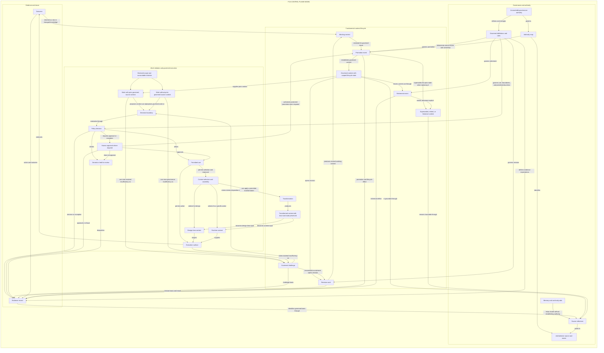

# Fundamental Context Architecture Blueprint

Version: `1.0`

Status: Founding Edition and first stable public doctrine release.

## Definition

Fundamental Context Architecture (FCA) is a vendor-neutral enterprise and company architecture for organizations being built, operated, or transformed as AI-first and AI-driven. It establishes how context fundamental to organizational work is governed and used across human and AI-supported activity.

Governed fundamental context becomes a first-class organizational asset. It shapes company design and human decisions, then carries the same governed foundation into AI-assisted and agentic execution.

Context is fundamental when organizational work materially depends on what it means, where its authority resides, whether it is available, or which state it is in. It is not confined to any one data, document, prompt, or knowledge representation.

Governance first establishes which source is authoritative, what the context means, and who owns it. It then determines whether the context is current for its purpose and whether its use is permitted. Any action it supports remains connected to explicit human accountability.

## Problem Statement

Organizations often adopt AI one use case at a time. Individual capabilities can be useful, yet they become difficult to scale when every implementation establishes its own understanding of context and its own rules for governing it.

Companies that want to become AI-first or AI-driven need an explicit architecture that identifies the context on which their work depends and connects it to authoritative sources. The architecture carries that governed context into human and AI-supported work, preserves evidence of its use, and returns useful results for accountable reuse.

Without this foundation, each AI capability and supporting system coordinates context through local implementation choices. The organization fragments how it understands, controls, and learns from its work.

The purpose is to prevent AI-enabled work from becoming disconnected context islands. Each useful adoption should contribute to a governed and reusable foundation that keeps organizational design, operation, and change reviewable.

## Core Claim

AI-first organizations need more than models and data. They need a governed contextual foundation.

Authority establishes where context comes from, what it means, who owns it, and how its provenance remains traceable. Lifecycle and boundary rules determine whether it is current, where it can be accessed or reused, and what agents may do with it. Human approval and explicit accountability govern consequential use, while evidence preserves what changed and why.

Many existing capabilities support this foundation, but none constitutes it alone. Models and agents depend on it during execution, while data, semantic, knowledge, governance, and workflow practices implement parts of it.

## Architectural Core

Fundamental context moves through a governed organizational cycle. Source authority grounds context in a governed home. The FCA control plane converts that authority and governed meaning into rules and decisions used throughout the architecture.

The FCA control plane coordinates the complete governed cycle. It carries source authority and governed meaning into operational decisions. Those decisions determine whether context may enter work and whether execution may proceed. Outcomes return as evidence, and useful results re-enter the cycle for governed reuse. The FCA Control Plane Model below makes these relationships explicit.

Context lifecycle is governed through the control plane. It keeps state and currentness clear while context is created, used, revised, promoted, superseded, or retired. Prior context therefore remains traceable without silently returning as current authority.

This coordination connects source authority to governed execution, evidence, and reuse. It turns separate governance records, knowledge capabilities, and execution systems into one contextual foundation for organizational design, operation, and change.

When AI-supported work depends on fundamental context, the same control plane determines which context can support a decision or action and whether it is current for that purpose. Decision boundaries apply the governing rules, require human approval where needed, and preserve evidence of the result.

Coordinating fundamental context across this cycle is FCA's distinct architectural responsibility. Specialist disciplines retain authority for their own methods and controls. Their contributions meet through the common contextual foundation rather than through parallel architecture work.

## Core FCA Primitives

The primitives below establish the conceptual vocabulary used throughout FCA. They make governed fundamental context concrete without prescribing its technical form. Their definitions come first. The FCA Control Plane Model then shows how they operate together.

### Context And Its Forms

Context is fundamental when its meaning, authority, availability, or state materially shapes organizational work. It affects how work is designed and understood, how decisions and execution proceed, and how results are reviewed, changed, and reused. This applies to work performed by people and to work supported or performed by AI and automation.

Operational context is the part of fundamental context used while work is actively conducted. It guides the course of the work, the decisions made within it, and the actions that follow. It also provides the context needed to review those actions.

Fundamental context becomes governed context when its authority and lifecycle are explicit. Known policies and boundaries control its use, while evidence and accountability make that use reviewable and reusable.

A context object gives fundamental context a bounded form that can be referenced and governed through use, review, action, and reuse. The form follows its purpose. Some context objects connect work to a source or express a decision, policy, or workflow. Others record evidence or lifecycle state, govern promotion and boundaries, or carry reusable knowledge.

Working context is context created or changed during active work that has not been established as shared authority. It can be used within its permitted scope, but it remains distinct from governed context until promotion.

Context supplied for declared work is assembled from one or more context objects relevant to that work. The assembly provides the governed basis and current state needed for the purpose. It becomes operational context while it is used in active work. Assembly does not merge or replace the authority, lifecycle state, or boundaries of the contributing objects. The control plane determines eligibility and permitted use; context supply selects and assembles the eligible objects for the work.

### Authority, Change, And Lifecycle

A source reference connects a context object to its governed source basis and identifies where authority is held. Derived and working surfaces can therefore preserve source authority without copying raw source material wherever the context appears.

A transformation occurs when context changes enough to influence work differently from its source. The result remains traceable to that source and to the governance state that applies. Enough trace is preserved to explain the change and its purpose without obscuring the original authority or the rules that continue to govern the result.

An authority map identifies the authoritative home and accountable owner for each scope or object family. It also identifies the rules that control change and reuse, including how context is promoted or superseded.

Lifecycle state expresses the governed position of a context object within a defined scope. Each object family gives clear meaning to the states it uses. Candidate material may move into an approved or current state. Other material may become superseded, retired, or stale, while local material can remain outside governed reuse.

Currentness determines whether context is current for a particular purpose at the time and place of use. It is never universal. The same artifact can remain current in one scope, be superseded in another, and survive elsewhere only as historical evidence.

A promotion event is the reviewed transition from working material into governed fundamental context. It establishes the authoritative source basis and accountable owner. The promotion decision also fixes the context's scope, provenance, lifecycle state, boundary rules, and accountability for reuse.

### Boundaries And Governed Use

A boundary rule determines where context can travel and what can happen to it. It governs ordinary use and reuse as well as exposure, transformation, promotion, and action.

A boundary can follow organizational or domain scope. It can also protect confidentiality or satisfy jurisdictional, contractual, regulatory, and risk obligations.

The decision boundary is the accountable point at which a proposed governed use is resolved. The use can be allowed, denied, escalated, or approved as an exception. Keeping this point explicit prevents retrieval results, agent behavior, workflow defaults, or tool permissions from silently deciding authority and accountability.

Permitted use asks more than whether an actor can read context. It determines whether that context may support a defined purpose or action within the applicable boundary and lifecycle state. Context can therefore be readable without being permitted for reuse, promotion, disclosure, AI-assisted action, or operational decision-making.

A policy decision resolves the proposed use. Identity and existing access rights inform that decision, while enforcement carries it into operation. Approval and audit evidence remain distinguishable so that the basis and accountability for the decision stay visible.

Permitted discretion defines the interpretation or variation that remains conforming for a particular purpose and scope. Its breadth follows the consequence and reversibility of the work. Its position in an authority hierarchy does not determine how strictly it is applied. Variation inside permitted discretion is not drift and requires neither an exception nor a challenge.

Where discretion is not explicit, reasonable interpretation applies to low-consequence work whose effects can be reversed. Consequential, irreversible, or protected work does not inherit undeclared discretion. Uncertainty is held or escalated.

A governed challenge records that current context, policy, or a boundary is materially insufficient for the declared work. The challenger identifies the insufficiency and its effect. Proposing replacement context is not required. Raising a challenge does not authorize departure or change authority.

The decision boundary determines how work proceeds while a challenge remains unresolved. Work inside permitted discretion continues. Departure outside that discretion requires a policy decision and the approval assigned to the applicable scope. Where departure is not authorized, work is held for accountable review.

The authority map identifies who can clarify or revise the challenged object. Any proposed replacement remains working context until FCA-governed revision, review, and promotion establish it as shared authority.

The FCA control plane is the coordinating capability through which governed rules are applied. It translates source authority and governed meaning into policy and boundary decisions. It governs when execution may proceed. It coordinates governed challenge and determines when working context can be assessed for promotion. It also defines the evidence returned from use. Context lifecycle operates through it. The capability can be distributed across systems, but it cannot be absent.

### Execution And Evidence

An evidence record preserves the reviewable trace needed to understand a decision, action, change, exception, or promotion later. It connects the governed source basis to what happened, the outcome, its lifecycle effect, and the accountable authority. This trace remains reviewable without weakening source authority or crossing access boundaries.

An execution surface is the human-facing or machine-facing place where context is used or acted on. The category covers interactive tools and operational systems as well as automated and agentic execution. These surfaces operate within the governance model; they do not replace it.

Design-time context shapes how work is designed. It also shapes the policies and workflows that govern the work, together with the models, prompts, automations, and controls that support it.

Runtime context is selected and supplied when a specific action or decision occurs, whether within a session or a workflow step. Supplying context at runtime does not make it authoritative.

## FCA Control Plane Model

The FCA Control Plane Model shows the complete governed cycle coordinated through the control plane. Authority grounds the context. Lifecycle and policy govern its movement into work. Execution returns evidence, and promotion carries approved results into reuse. These responsibilities can remain distributed while their relationships stay governed as one model.

A context object can draw from a governed source or emerge from new work. Existing authority remains with the source when context is selected or transformed. When context enters governed use, the rules that apply determine whether that use is allowed.

The context can then support human or AI-enabled work. Where evidence is required, it connects the outcome to the context and decision that supported it. New knowledge remains working context until a separate promotion decision makes it governed and reusable.

When governed context changes, its lifecycle records what became current and what was superseded. Earlier decisions remain understandable through their evidence without allowing historical context to silently return as current authority.

## Minimum FCA Kernel

The minimum kernel defines the architectural distinctions that keep fundamental context governed through use and reuse.

Conformance is assessed within a declared implementation scope. An implementation conforms to FCA `1.0` only when every distinction and responsibility defined by this kernel is present throughout that scope.

Implementing only part of the kernel may still improve contextual governance, but it is partial adoption rather than FCA `1.0` conformance.

### Authority And References

Source authority remains separate from continuity. Systems that help people or agents find and carry context across work do not become authoritative by performing that role. A continuity system holds source authority only when the authority map assigns it a defined record class.

Every governed use preserves the distinction between a reference to an authoritative source and a reference to a continuity aid.

The authority map assigns durable shared truth to its governed home. That home remains explicit and reviewable even when continuity, retrieval, or execution surfaces carry derived representations of the context.

Current authority also remains separate from historical context. Superseded material remains traceable to what replaced it and to decisions made while it applied. The trace explains why the change occurred. Historical context does not appear as active guidance unless its status is explicit.

### Promotion And Boundaries

Working context remains distinct from governed fundamental context. Material produced through exploration or local execution can influence future governed context, but creation alone does not make it authoritative or reusable across the organization. This applies equally to human and agent-generated material.

Promotion is the reviewed transition that establishes the source authority and owner. It fixes the context's scope and provenance, assigns its lifecycle state, and makes accountability for reuse explicit.

Boundary rules determine which uses are permitted and whether reuse or promotion requires approval. Their architectural meaning remains independent of the storage or tenancy arrangement used to represent and enforce them.

When promotion moves context across a protected boundary, the promotion establishes that reuse is permitted within the receiving scope. The accountable human authority approves the movement where that boundary requires approval.

### Execution And Retrieval

Execution surfaces act on governed context within the governance model. Source authority, access rights, lifecycle state, promotion rights, and accountability remain governance decisions that can be audited independently of the surface.

Retrieval and context assembly make governed context visible and usable. Whether assembly relies on search, vectors, graph traversal, or a combination of them does not change where governance occurs.

Governance determines which source is authoritative and current. The authority map continues to determine ownership, while policy determines who may access, reuse, or promote the context. Lifecycle determines whether an earlier state has been superseded. Retrieval therefore operates downstream from governance.

### Policy, Drift, And Evidence

Context policy determines whether a proposed use of governed context is permitted and under what conditions. It exists because technical access to context does not authorize every possible use of it.

The identity and existing access rights of the person or system requesting context inform the decision, but they do not settle it. The governing rule determines whether the proposed use is allowed, while enforcement carries that decision into operation.

Approval and exception handling remain identifiable when policy cannot resolve the use automatically. Evidence preserves the basis and outcome so that the reason for allowing or refusing the use can be reviewed.

Policy defines how much interpretation is allowed for the work. This is permitted discretion. Work that stays within it remains conforming and is not treated as drift.

The authority map assigns responsibility for classifying consequence and reversibility to the accountable architect or process owner for the scope. That classification becomes a governed rule. It is not chosen by the person, agent, or system performing the work. A recurring family of work can be classified once and reused throughout its governed scope.

When discretion has not been defined, reasonable interpretation is allowed only where the governed classification identifies the work as low-consequence and reversible. For work classified as consequential, irreversible, or protected, uncertainty is held or escalated. Work without an applicable classification is also held or escalated for classification.

When current context, policy, a boundary, or the applicable classification is materially insufficient, the implementation provides a governed challenge path. Raising a challenge identifies the problem but does not permit the work to ignore current authority. The decision boundary determines whether work can continue. It also determines whether approval is required or the work must be held.

If the challenge leads to a proposed change, that change remains working context. It becomes shared authority only through governed revision, review, and promotion.

Evidence shows which governed classification and permitted discretion applied to the work. When work departed from them, the evidence preserves the approved exception or governed change that allowed it. It also preserves each challenge and its resolution.

Evidence is a first-class output of governed work. It preserves how a governed decision or action was reached and how the work changed or promoted context.

Evidence connects the work to its governed source basis without becoming an uncontrolled copy. It identifies the source references that supported the work and records the resulting decision or action. It also records the outcome's lifecycle and reuse status. That status shows whether the outcome remains local, can be promoted or reused, or has been superseded.

When source material belongs in a protected or changing authoritative home, evidence refers to that home instead of duplicating the material. Stable references preserve source authority and provenance without crossing access boundaries, while keeping the work reviewable and reusable.

Records management and retention policy remain separate responsibilities. The implementation determines when evidence becomes a record and when it remains ephemeral. Retention and disposal follow the applicable formal obligations together with operational and historical need. Each source system retains authority for the records assigned to it.

### FCA Control Plane

Every conforming implementation includes an FCA control plane. It is the coordinating core through which source authority and governed meaning become rules and decisions applied throughout the architecture.

Before context is supplied or acted on, the control plane coordinates policy decisions and boundary enforcement. When working context is assessed for reuse, it governs the promotion decision. It determines the conditions under which execution can proceed, the evidence that execution returns, and how outcomes re-enter governance. This keeps the complete path from source authority through governed reuse coherent and reviewable.

The control plane can be distributed across several systems, but its architectural responsibility remains explicit. The implementation can identify where its governing rules are defined, how they are changed, and who has authority over those changes.

Core context terms and permitted relationships have explicit meanings within the governed scope. Relevant families of context objects have identified source authorities. The control plane establishes the protection and evidence requirements that make governed decisions auditable.

#### Context Lifecycle And State

Context lifecycle is governed through the control plane. For each family of context objects, it defines how working context can be promoted, how governed context is revised, when current authority is superseded, and how context is retired or preserved as historical material.

Every lifecycle state is interpreted within its object family and scope of applicability. An implementation can explain where a context object is current, where it has been superseded, and how that status affects its use. A lifecycle label carries only the meaning assigned within that scope; the same label is not assumed to mean the same thing everywhere.

## Intended Scope

The contextual foundation applies throughout how an AI-first organization is designed, operated, and changed. It governs context carried through data and documents, expressed through decisions and policies, embedded in workflows and knowledge, and used in actions performed by people or agents.

The architecture remains tool-agnostic. Implementations provide the required capabilities and evidence through technology appropriate to their scope. No particular cloud, repository, database, graph engine, retrieval stack, semantic layer, data architecture pattern, or AI platform defines the architecture.

## Evidence That FCA Is Working

Effective operation is demonstrated when governed context improves real work and that work leaves behind context and evidence the organization can review and reuse. Documentation or tooling alone does not demonstrate success.

The evidence is proportional to the scope and consequence of the work. No single measure establishes that FCA is working. Taken together, the relevant evidence establishes that:

- Authority remains clear. People and systems can identify the governed source and distinguish current governed context from working or historical material.

- Governed context is present in real work. It reaches people and execution surfaces where decisions and actions occur, either through deliberate consultation or through approved automatic supply. Users do not have to reconstruct basic context or hesitate over which source applies.

- Local and personal context remains bounded. It supports continuity and active work without silently contradicting, replacing, or drifting from governed context.

- Governed work remains explainable. Evidence connects the applicable context and permission decision to the resulting action, change, exception, or outcome. Accountability remains identifiable.

- Useful results become reusable. New or changed context follows the promotion path, and later work can reuse the governed result instead of recreating disconnected local copies.

- Governance remains proportionate and helpful. It reduces uncertainty and reinvention without obstructing work beyond what its authority, boundary, consequence, and reuse conditions require.

- The architecture remains coherent across implementation changes. FCA distinctions remain understandable when tools, teams, domains, or delivery choices change.

## FCA Failure Modes

An implementation fails to preserve FCA when the architecture is reduced to documentation, retrieval, AI tooling, compliance workflow, or architectural taxonomy. It also fails when context can be reused or acted on without clear authority, lifecycle state, boundary permission, evidence, and accountability.

Reviewability is lost when authority is hidden inside tools or retrieval silently outranks source records. The same failure occurs when agents act outside auditable policy, lifecycle labels become ambiguous, or evidence records turn into uncontrolled copies of restricted material.

Practical FCA failure modes include:

- Retrieval presented as governance. Search, RAG, GraphRAG, or memory can help find and assemble context, but they do not decide authority, currentness, permitted use, lifecycle state, approval, or accountability.
- Semantic structure without authority. A glossary, ontology, taxonomy, semantic layer, or knowledge graph does not create governed context unless source authority, ownership, lifecycle, and reuse rules are explicit.
- Stale material treated as current authority. Documentation, summaries, indexes, or memories can support continuity, but they must not override the current authoritative source.
- Access treated as permission to act. A person, assistant, automation, or agent may be able to read context but still not be permitted to reuse it, disclose it, transform it, promote it, or act on it.
- Approval without evidence. A gate, review, or exception is not enough if a later reviewer cannot reconstruct what was approved, by whom, from which source basis, and under which policy or boundary.
- Governance that prevents governed reuse. Boundary rules can fail by being too weak, but they can also fail by being so broad that lawful, useful, and reviewable reuse becomes impossible.

## Final Author Statement

Now that you have read through all of this, you may still be wondering: I understand the areas and their relationships, but how do I actually implement them?

That question is intentional. The blueprint identifies the architectural responsibilities that must exist and shows how they relate. Your implementation maps its actual organizational scope to those responsibilities and realizes the FCA control plane that coordinates them.

The control plane is an architectural responsibility, not a prescribed product. It can be realized through governed rules and operating practices, through software, or through a combination of them. Its realization can grow with the needs of the implementation, while the minimum FCA kernel remains present throughout the declared scope.

If I prescribed one exact implementation path, you could overbuild it, underbuild it, or follow my model too strictly where your organization needs something different. That is not my intention. My intention is to give you enough architectural structure to carve your own model while preserving the FCA kernel that prevents silent drift.

The [implementation guidance](docs/implementation_guidance.md) provides practical starting points without turning them into one required implementation.
