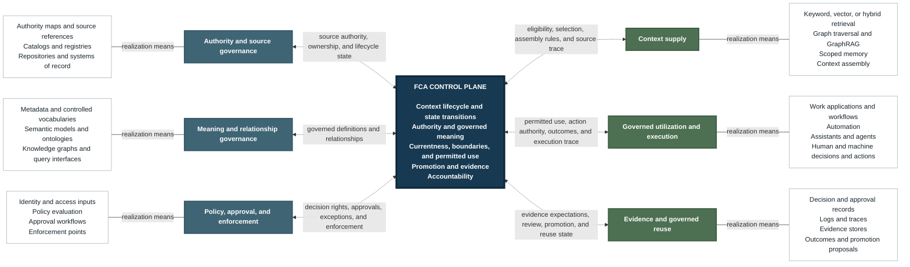

# FCA Implementation Guidance

Status: supporting guidance for FCA `1.0`
Authority: explanatory guidance; the kernel remains in `blueprint.md`

## Purpose

This document translates the minimum FCA kernel into implementation decisions. It explains how the kernel becomes visible in systems and operating practices while preserving the architectural distinctions on which governance depends.

The blueprint defines FCA. This document guides its implementation.

## Start With The Governed Outcome

An FCA implementation starts with a concrete piece of work and defines the governed outcome it needs to achieve. The same principle applies when improving existing work and when designing new work from the beginning.

The result is a clear implementation statement. It defines the work and the context on which it depends. It states how that context remains governed through use and what evidence demonstrates successful operation.

Technology selection follows that statement. Its value is judged by whether it establishes the governed outcome.

## Resolve Operating Tensions Before Design

Before technical design begins, the implementation identifies tensions that could change the governed outcome. A tension exists where two or more legitimate objectives pull the work in different directions. Broad reuse can conflict with confidentiality. Faster execution can conflict with accountable review.

Each material tension results in a recorded operating position for the scope. The position states how the conflict is resolved in the relevant circumstances and who is accountable for exceptions.

These positions become design constraints. They determine how the work is allowed to operate before a technical mechanism is chosen. An unresolved tension remains an explicit open decision rather than being settled silently by the system design. They are also natural human review checkpoints.

## Define Bridge Objects Before Technical Specification

Before designing technical systems, an FCA implementation defines how the doctrine will become visible in operational records and interfaces. These representations are bridge objects.

A bridge object makes one FCA distinction concrete within an implementation. A source reference connects context in use to its authoritative home. A promotion record captures the decision that makes working context governed and reusable. An evidence record preserves the trace needed to review a decision or action later. These are simple examples, not required object names or a universal schema.

Defining bridge objects first prevents a schema or tool from deciding the architecture by accident. Technical design then implements governed meaning rather than becoming its source. This is where abstraction becomes implementation.

## Trace Context From Source To Use

A source-to-use trace makes governed use of context reconstructable. It connects the authority behind the context to the outcome it influenced without requiring every part of the resulting work to carry its own lineage.

New work can begin without prior authoritative content and remains working context until it is promoted. A missing trace is a governance gap only where the governance model requires one.

The trace is logical, not a prescribed pipeline. It preserves the distinction between a source and its derivatives, and between technical access and permission to act. The required depth of trace follows the consequence and governance state of the work.

## Use Restricted Context Without Broad Exposure

Restricted context can govern work without being disclosed to every person or execution surface involved. The source remains in its authoritative home, while the work receives only the decision or constraint it needs.

An optional compliance-service pattern places an intermediary between the restricted source and the work. The intermediary evaluates a proposed answer or action. It can allow the work, require a change, or send it for escalation without exposing the protected source.

Privileged legal guidance, for example, can be used to review a customer answer without entering an assistant's runtime context. A protected security rule can restrict an automated action without revealing the rule itself to the operator. In both cases, the evidence records the governing decision rather than copying the restricted source.

The governing requirement is that the authority behind the decision and the permitted use of restricted context remain reviewable.

## Put Controls At Natural State Changes

Controls are most effective when attached to a transition that already changes the meaning or status of work. A clear before-and-after state makes it possible to determine which checks apply and what evidence remains.

When local material becomes shared guidance, the promotion point is where its authority and scope are reviewed. When completed internal work becomes an external deliverable, that transition is where boundary and approval rules apply.

FCA applies proportionate control when a transition changes the governance significance of the work. The exact control follows the consequence of the new state rather than a universal checklist.

## Account For Runtime Context Risks

Context can be governed in its authoritative home and still fail at the moment of use. An FCA implementation accounts for the risks introduced when context is assembled or acted on. Runtime controls keep that governance effective through execution.

Currentness fails when an obsolete operating instruction is supplied as current. Integrity fails when unreviewed or malicious material enters retrieval and is treated as governed context. Before consequential use, the implementation establishes that supplied context is current for its purpose and eligible to be treated as governed. Evidence preserves the basis for that decision.

Boundary protection and permitted use fail when an assistant uses one customer's restricted terms while working for another. Execution control fails when retrieved content redirects an agent beyond its approved action. The implementation evaluates permitted use before protected context is exposed and enforces action authority when execution occurs. Evidence preserves the decision and resulting action.

Traceability fails when a summary removes a condition that materially changes the source meaning. Transformations therefore remain connected to their source basis. Evidence shows how the changed context supported the resulting outcome.

Implementations use the risk taxonomy appropriate to their scope. The illustrations above represent the most common runtime risk patterns and are narrowed or extended according to the needs of the work under governance. FCA evaluates runtime control by its outcome and reviewability. The depth of control and evidence follows the consequence and governance state of the work.

## FCA Capability Architecture

The diagram below presents the logical capability architecture of an FCA implementation. Capabilities on the left establish the governed organizational foundation. Capabilities on the right supply that context to work and return evidence for governed reuse. The white nodes identify mechanisms and technology families that can realize each capability. Those mechanisms support the capability; they do not inherit its authority.

At the center, the FCA control plane forms the governing core. It determines where authority resides and what context means. Context lifecycle and state transitions operate through it, keeping currentness, boundaries, permitted use, promotion, evidence, and accountability coherent across the architecture.

Each dotted bidirectional relationship connects the core to an individual FCA capability. Its label identifies the responsibility governed through that relationship and the state or evidence returned to the core. These are logical governance relationships. They do not require context or data to pass physically through one centralized platform.

The absence of direct relationships between peripheral capabilities is intentional at this level. Context supply does not independently authorize exposure or action. Governed utilization does not establish its own authority or evidence requirements. Evidence and reuse remain subject to lifecycle and promotion decisions. Their interactions are coordinated through the FCA control plane.

The detailed operational and lifecycle sequence remains defined in the [FCA Control Plane Model](../blueprint.md#fca-control-plane-model). Retrieval, graph traversal, memory, and context assembly participate behind the context-supply capability. They make governed context findable and usable without establishing authority, permitted use, lifecycle state, or promotion rights.

### Technology Roles Within The Capability Architecture

Technology is selected according to the FCA capability it realizes. Product category alone does not determine architectural role. When one platform performs several responsibilities, each responsibility remains explicitly assigned and independently reviewable.

A ticketing or case-management system demonstrates the distinction. It can coordinate execution, hold the authoritative record for a declared case type, and preserve approval evidence. These responsibilities remain separate even when one system performs all three. The authority map identifies which records the system owns. Lifecycle rules govern how those records change state. Evidence requirements define what their history must preserve.

The same principle applies to storage. Technical form does not determine architectural role. A graph can represent governed relationships or support retrieval. A vector index generally remains derived from another source. A document or relational store can hold authoritative or working material. An object store can preserve source artifacts. An event log can preserve execution evidence. A cache ordinarily remains working infrastructure unless governance assigns it a different role.

#### Authority And Source Governance

Source authority remains with the system accountable for a declared record class. That system can be an established system of record, a governed repository, or the live operational system that maintains the record. Specialized records follow the same principle. A decision log can own decisions, while a policy repository can own policy. Governed knowledge, metadata, and case history can each have another declared authoritative home. The authority map records each assignment and identifies how those records change state.

#### Meaning And Relationship Governance

Governed meaning is expressed through a representation suited to its scope. A controlled vocabulary or taxonomy can establish shared terms. An ontology can make richer semantics explicit, while a knowledge graph can represent governed relationships. Query surfaces make those structures addressable to work. They can use GraphQL, SQL, APIs, or document metadata without acquiring authority over the meaning they expose. Making context addressable does not redefine its lifecycle, access conditions, or ownership.

#### Policy, Approval, And Enforcement

Identity and access-management systems establish who or what is making a request and what technical access already exists. Those facts inform the context-policy decision; they do not determine it. A policy engine or application logic can evaluate the proposed use.

When human approval is required, an accountable workflow records the decision and any exception. That workflow can operate through a ticketing system, case-management system, or another review surface. Enforcement applies the result where context is exposed or action occurs.

A single product can support more than one stage. Even then, the policy decision remains distinct from the approval and enforcement that follow it. Exceptions remain explicit, and evidence from every stage remains reviewable.

#### Context Supply

Context supply begins only after governance has established what is eligible for the work. Exact-match search, including keyword or BM25-style methods, retrieves known terms. Vector or hybrid retrieval extends discovery to semantic matches. Reranking orders eligible results; it does not make ineligible material eligible. Graph traversal and GraphRAG can assemble context connected through governed relationships. Scope filters keep that assembly within the permitted sources and boundaries. These techniques make context available downstream from governance. They do not establish authority or permission.

Memory addresses continuity rather than source authority. It can preserve relevant state for an individual. It can also support continuity across team, project, or organization-wide work. This supports handoff and repeated activity. Memory becomes authoritative only when governance assigns the memory system a narrowly defined record class.

#### Governed Utilization And Execution

Governed context enters the surfaces where work is performed. AI-enabled execution can occur through an assistant, automation, or agent. Established work can continue through workflow engines and operational applications. Notebooks, development environments, chat systems, and ticketing or case-management platforms can also participate when they fit the scope.

Regardless of form, an execution surface acts within governance decisions already established for the context. It does not acquire source authority merely by consuming that context. Nor does it determine access, lifecycle, promotion, or accountability unless governance explicitly delegates that responsibility. Any delegated decision remains auditable outside the execution surface.

#### Evidence And Governed Reuse

Evidence explains both permission and execution. Approval records show why governed use was allowed or refused, including the outcome of review or exception handling. Run logs and traces show what the execution surface did. Stable source pointers connect that activity to its governed basis. Decision records or evidence bundles preserve what later review and learning require.

A ticket or workflow history can contribute to that evidence when its source role and lifecycle are explicit and its retention treatment is known. Evidence should refer to stable governed sources when copying material would weaken boundaries or source authority. This is particularly important when source material is restricted or likely to change, or when a copied version could be mistaken for the authoritative record.

## Reviewing Conformance

Conformance is assessed directly against the [Minimum FCA Kernel](../blueprint.md#minimum-fca-kernel). This guidance does not restate or extend those requirements.

An implementation review begins by declaring its scope and then follows each kernel responsibility into operation. The review establishes where governance decisions are made and who is accountable for them. It also verifies that those decisions are enforced and that the resulting evidence remains reviewable. Evidence depth follows the consequence and scope of the work. Naming a tool is insufficient unless the governed responsibility it performs is clear.
